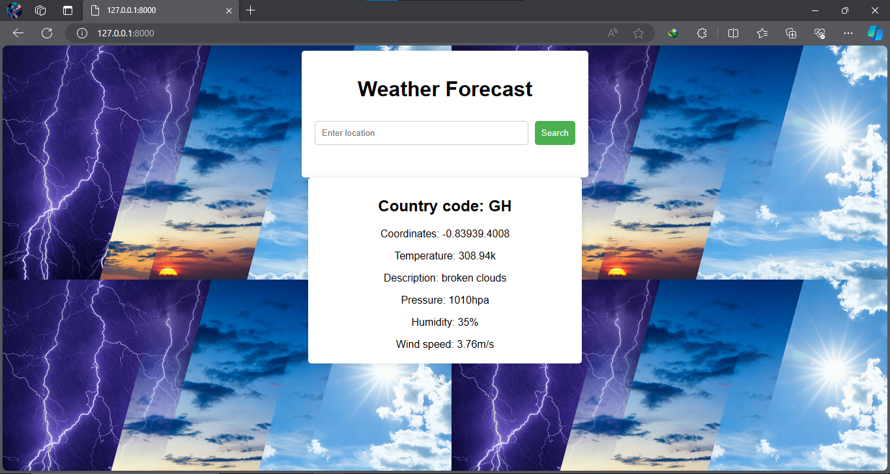

# Django weather app

Welcome to my Django Weather App! This web application allows users to check the current weather conditions for any location worldwide.

## Features

- Weather Information: Users can enter a location and view the current weather conditions, including temperature, humidity, wind speed, and weather description.
- Search Functionality: Users can search for weather information by entering the name of the desired location.
- Responsive Design: The app is designed to be responsive, ensuring optimal viewing experience on desktops.
- User-Friendly Interface: The interface is intuitive and easy to use, making it accessible to users of all technical levels.

## Installation

1. Clone this repository to your local machine:
   `git clone https://github.com/Stan1-0/weatherapp.git`
2. Navigate into the project directory:
   `cd weatherapp`
3. Install the required dependencies:
   `pip install -r requirements.txt`
4. Run the Django development server:
   `python manage.py runserver`

Open your web browser and navigate to `http://127.0.0.1:8000/` to access the application.

## Usage

- Enter the name of the location for which you want to check the weather in the provided input field.
- Click on the "Search" button.
- The weather information for the specified location will be displayed on the screen.

## Technologies Used

Django: A high-level Python web framework that encourages rapid development and clean, pragmatic design.
OpenWeatherMap API: Used to fetch weather data for various locations.
HTML/CSS: For front-end design and structure.

## Contributing

We welcome contributions from the community! If you would like to contribute to the project, please follow these steps:

- Fork the repository.
- Create a new branch (`git checkout -b feature/improvement`)
- Make your changes and commit them (`git commit -am 'Add new feature'`)
- Push to the branch (`git push origin feature/improvement`)
- Create a new Pull Request.

## Acknowledgements

- Thanks to OpenWeatherMap for providing the weather data API.

## Screenshot

